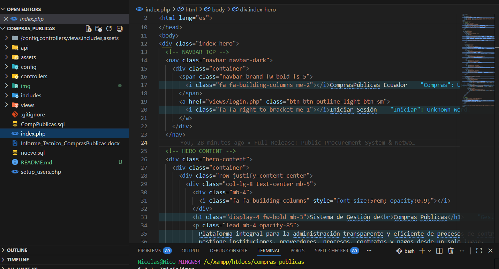
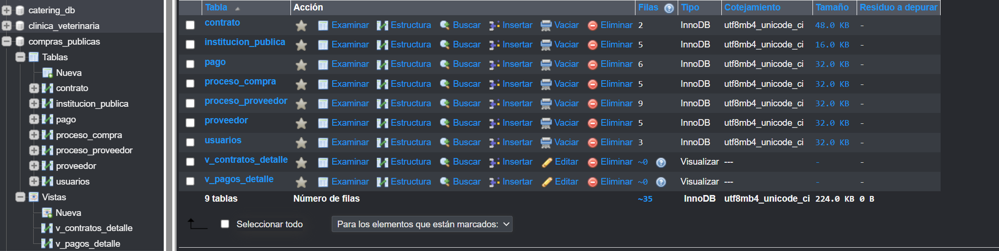
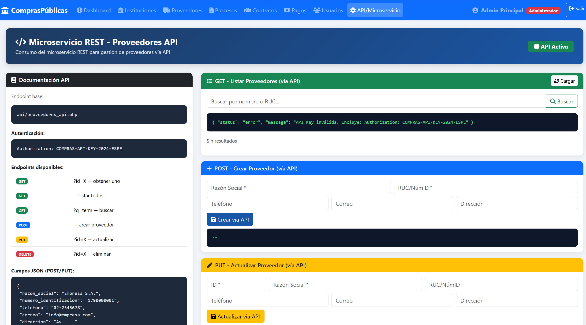
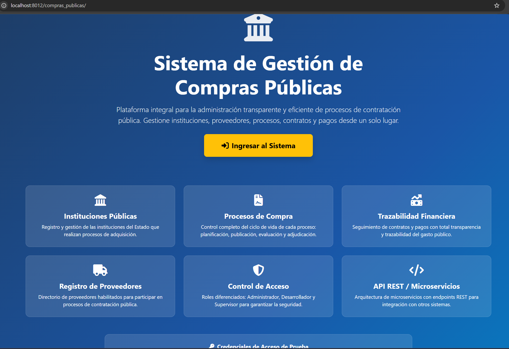
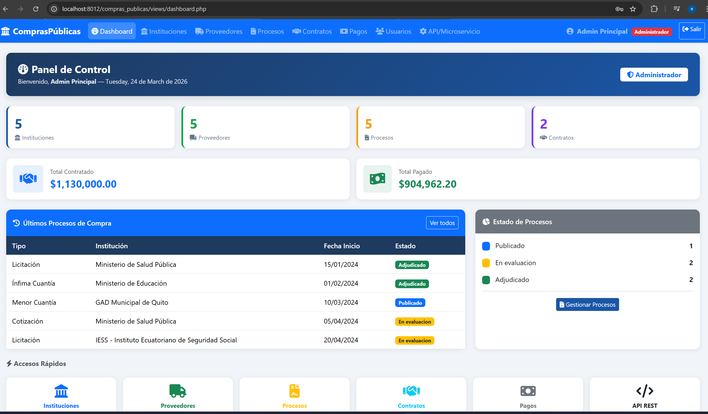
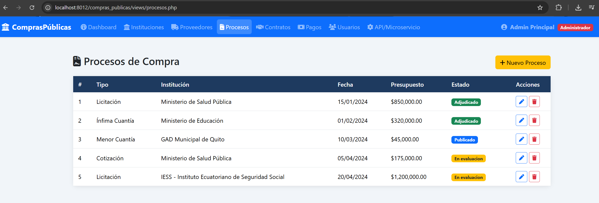
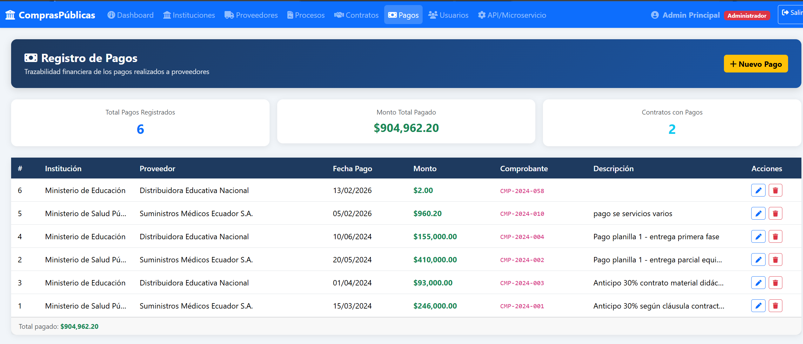
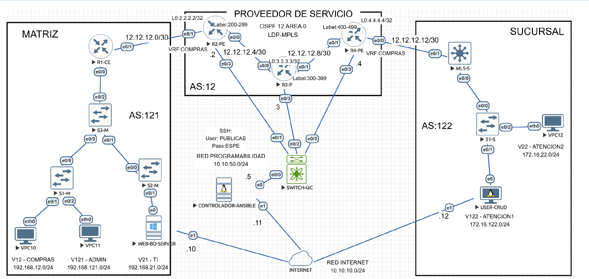
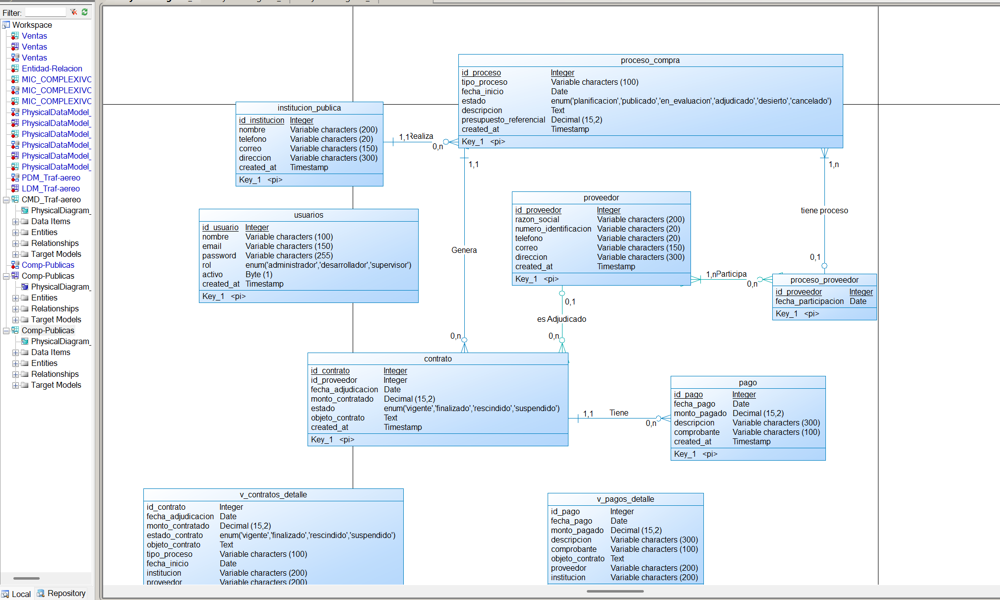

# Public Procurement Management System & IaC Infrastructure

Este proyecto representa mi defensa de grado (MIC) para la carrera de Ingeniería en TI. Es una solución integral que abarca desde el desarrollo de software hasta la automatización de redes.

## 🚀 Componentes del Proyecto

### 1. Software & Backend
- **Tecnologías:** PHP (Backend), MySQL (DB), REST API.

- **Arquitectura:** Orientada a servicios con consumo de microservicios para autenticación y gestión de roles (Admin, Supervisor, Desarrollador).

- **Módulos:** Gestión de proveedores, procesos de adjudicación, contratos y pagos.

### 2. Infraestructura de Red (IaC)
- **Automatización:** Playbooks de Ansible para la configuración de VPNs MPLS L3.
- **Herramientas:** EVE-NG para simulación, Cisco IOS para el core de red.
- **Logros:** Configuración automática de protocolos de enrutamiento y conectividad extremo a extremo entre Matriz y Sucursales.

### 3. Base de Datos
- **Diseño:** Modelado Conceptual, Lógico y Físico (PowerDesigner).

- **Seguridad:** Implementación de roles granulares y triggers para integridad de datos.

---
**Ing. Edison Nicolas Guamialama Haro** | Software Architect & Network Engineer